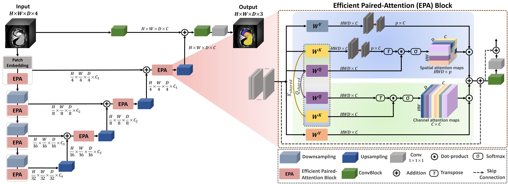
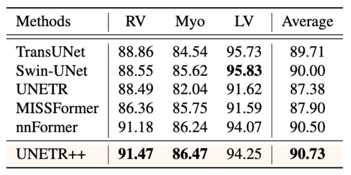
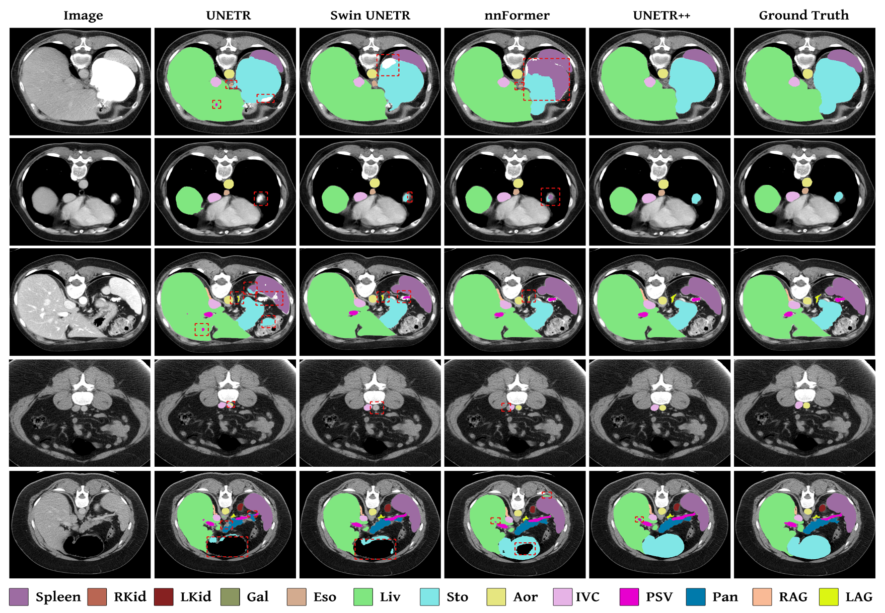

[Abdelrahman Shaker](https://scholar.google.com/citations?hl=en&user=eEz4Wu4AAAAJ), [Muhammad Maaz](https://scholar.google.com/citations?user=vTy9Te8AAAAJ&hl=en&authuser=1&oi=sra), [Hanoona Rasheed](https://scholar.google.com/citations?user=yhDdEuEAAAAJ&hl=en&oi=ao), [Salman Khan](https://salman-h-khan.github.io/), [Ming-Hsuan Yang](https://scholar.google.com/citations?user=p9-ohHsAAAAJ&hl=en&oi=ao) and [Fahad Khan](https://scholar.google.es/citations?user=zvaeYnUAAAAJ&hl=en)


<br>

&emsp;&emsp;&emsp;&emsp;&emsp;&emsp;&emsp;&emsp;&emsp;&emsp;&emsp;&emsp;&emsp;&emsp;&emsp;&emsp;&emsp;&emsp;&emsp;&emsp;&emsp;&emsp;&emsp;&emsp;&emsp;&emsp;&emsp;&emsp;&emsp;&emsp;&emsp;&emsp;&emsp;&emsp;&emsp;&emsp;&emsp;&emsp;&emsp;&emsp;&emsp;&emsp;&emsp;&emsp;&emsp;&emsp;&emsp;&emsp;&emsp;&emsp;  [Paper](https://arxiv.org/abs/2206.10589): [](https://arxiv.org/abs/2206.10589)  , [Code:](https://github.com/Amshaker/unetr_plus_plus) [](https://github.com/Amshaker/unetr_plus_plus)

<br>

<p align="center">
<iframe width="560" height="315" src="https://www.youtube.com/embed/5yQPtNVSFVc" title="YouTube video player" frameborder="0" allow="accelerometer; autoplay; clipboard-write; encrypted-media; gyroscope; picture-in-picture" allowfullscreen></iframe>
</p>

<br>

## Overview
<p align="center">
<!--  -->

</p>
<p align="justify" style="width:740px;">
We propose an efficient hybrid hierarchical architecture for 3D medical image segmentation, named UNETR++, that strives to achieve both better segmentation
accuracy and efficiency in terms of parameters and FLOPs. Compared to best existing nnFormer, UNETR++ achieves better segmentation performance while significantly reduces the model complexity by over 71%.
</p>
## Abstract




<p align="justify" style="width:740px;">
Owing to the success of transformer models, recent works study their applicability in 3D medical segmentation tasks. 
Within the transformer models, the self-attention mechanism is one of the main building blocks that strives to capture long-range dependencies, compared to the local convolutional-based design. However, the self-attention operation has quadratic complexity which proves to be a computational bottleneck, especially in volumetric medical imaging, where the inputs are 3D with numerous slices. 
    
In this paper, we propose a 3D medical image segmentation approach, named UNETR++, that offers both high-quality segmentation masks as well as efficiency in terms of parameters and compute cost. The core of our design is the introduction of a novel efficient paired attention (EPA) block that efficiently learns spatial and channel-wise discriminative features using a pair of inter-dependent branches based on spatial and channel attention.
Our spatial attention formulation is efficient having linear complexity with respect to the input sequence length. To enable communication between spatial and channel-focused branches, we share the weights of query and key mapping functions that provide a complimentary benefit (paired attention), while also reducing the overall network parameters. Our extensive evaluations on three benchmarks, Synapse, BTCV and ACDC, reveal the effectiveness of the proposed contributions in terms of both efficiency and accuracy. On Synapse dataset, our UNETR++ sets a new state-of-the-art with a Dice Similarity Score of 87.2%, while being significantly efficient with a reduction of over 71% in terms of both parameters and FLOPs, compared to the best existing method in the literature.
</p>


## Comparison with SOTA (Synapse)


## Comparison with SOTA (ACDC)


## Comparison with SOTA (BTCV)


## Qualitative Results (Synapse)




## Qualitative Results (ACDC)


## Citation
```


```

## Contact
Should you have any question, please create an issue on our repository or contact us at [abdelrahman.youssief@mbzuai.ac.ae](abdelrahman.youssief@mbzuai.ac.ae) & [muhammad.maaz@mbzuai.ac.ae](muhammad.maaz@mbzuai.ac.ae)
